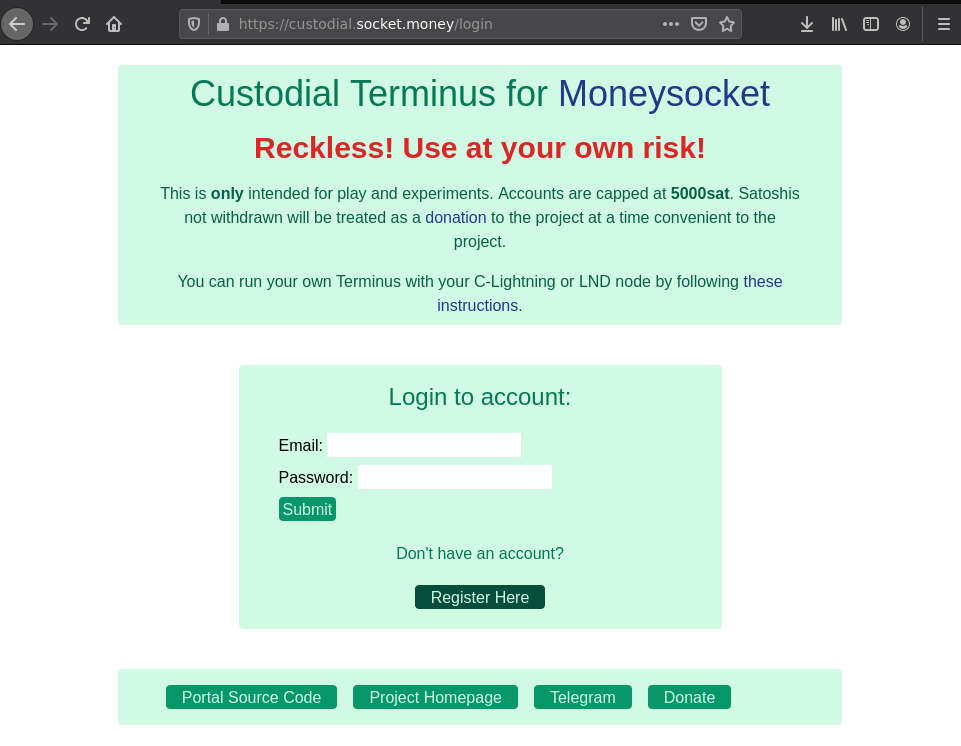
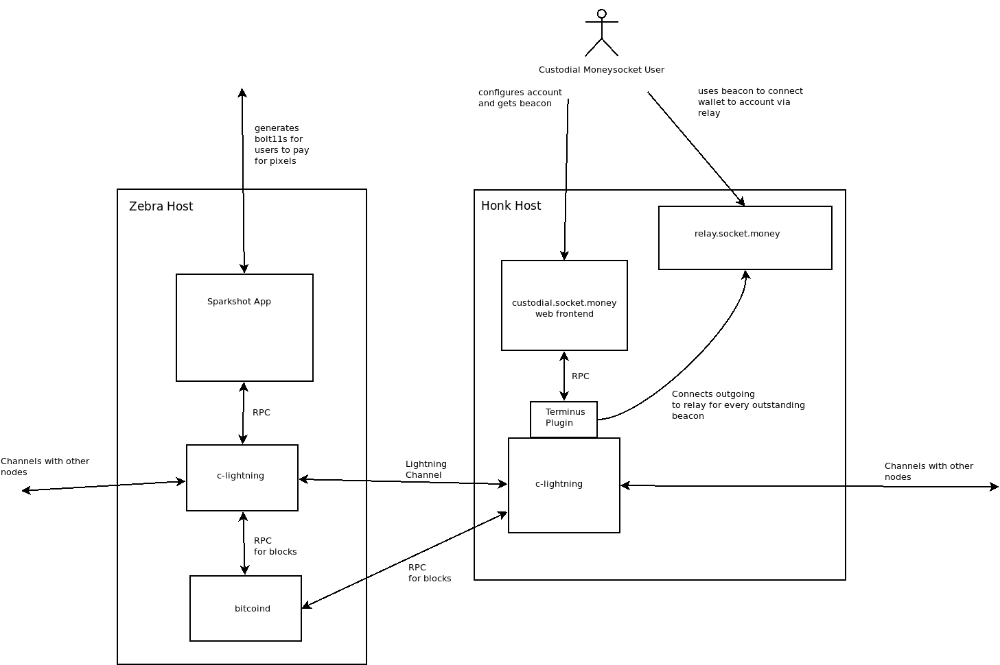

# Custodial Terminus Web Portal
Web configuration portal for the custodial terminus running at [custodial.socket.money](https://custodial.socket.money). It is not meant to be a "bank" but more as a tool for quick onboarding, testing and assisting with development.




# Requirements

This portal is written with Flask and SQLAlchemy. The python requirements are listed in requirements.txt

```
$ pip3 install requirements.txt
```


# config file

The app uses the directory `.moneysocket-custodial/` in the user's home directory.

A file `~/.moneysocket-custodial/moneysocket-custodial.conf` specifies the configuration. An example config is provided [here](config/moneysocket-custodial.conf)

# talking to the terminus

The running app interfaces with the [Terminus](https://github.com/moneysocket/custodial)'s RPC port to pull information and perform configuration. The connection details must be specified in the config.

# SQLite Database

The user login credentials are stored in a file `~/.moneysocket-custodial/moneysocket-custodial-database.db` which is a SQLite database. The [dump.py](dump.py) script will dump the stored contents of the database.


# Running webserver

The [custodiald](custodiald) executable starts the `guincorn` web server. Test certificates are provided in the [config/](config/) subdirectory for running with localhost (will have to grant exception for the certificat in your browser).

# deployment

This is currently set up like this on the cloud:





Project Links
------------------------------------------------------------------------

- [Homepage](https://socket.money).
- [Twitter](https://twitter.com/moneysocket)
- [Telegram](https://t.me/moneysocket)
- [Donate](https://socket.money/#donate)
